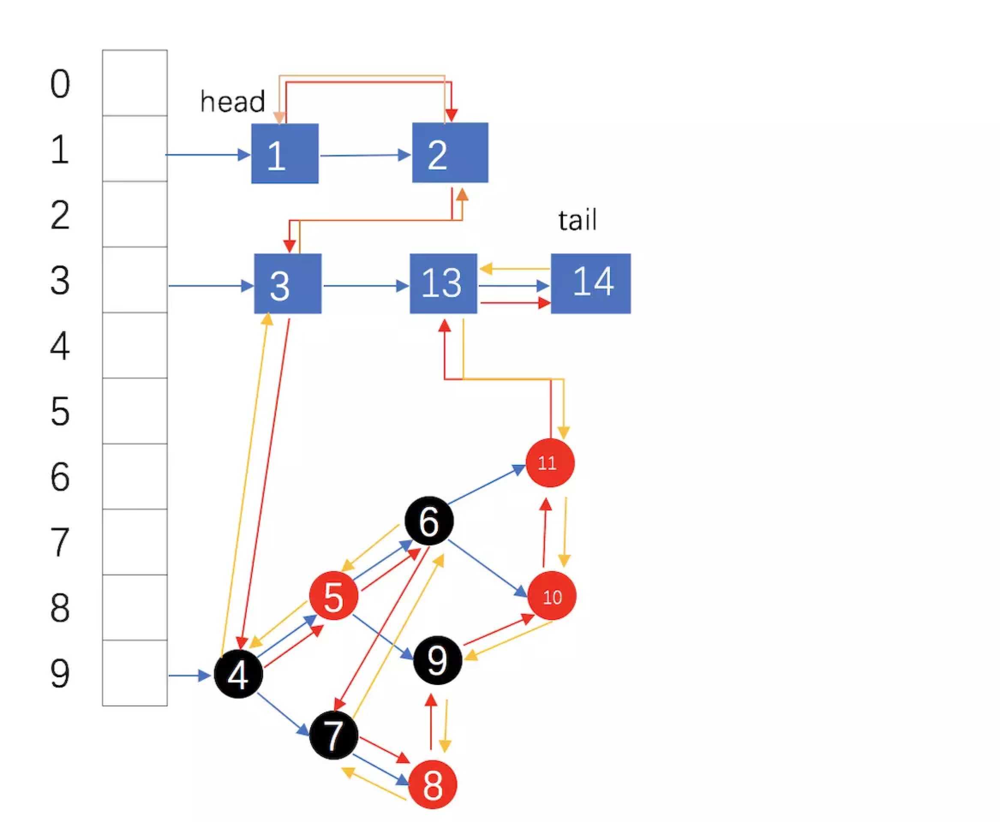

# LinkedHashMap

- Hash table and linked list implementation of the Map interface, with predictable iteration order.

- This implementation differs from HashMap in that it maintains a **doubly-linked list** running through all of its entries.

- This linked list defines the iteration ordering, which is normally the order in which keys were inserted into the map (insertion-order). Note that insertion order is not affected if a key is re-inserted into the map. 

- This implementation spares its clients from the unspecified, generally chaotic ordering provided by HashMap (and Hashtable), without incurring the increased cost associated with TreeMap. It can be used to produce a copy of a map that has the same order as the original, regardless of the original map's implementation:
    ```
    void foo(Map m) {
             Map copy = new LinkedHashMap(m);
             ...
         }
     
    ```


- 双向链表的实现(running through all of entries, not just in a bin(or bucket)). 表头的before为null 表尾的after为null
    - The head (eldest) of the doubly linked list.
    - The tail (youngest) of the doubly linked list.
    ```
    //LinkedHashMap 的节点为 Entry<K,V> extends HashMap.Node<K,V>
    static class Entry<K,V> extends HashMap.Node<K,V> {
            Entry<K,V> before, after;
            Entry(int hash, K key, V value, Node<K,V> next) {
                super(hash, key, value, next);
            }
        }
    ```
    ``` 
    //在调用LinkedHashMap的newNode构造
    Node<K,V> newNode(int hash, K key, V value, Node<K,V> e) {
            LinkedHashMap.Entry<K,V> p =
                new LinkedHashMap.Entry<K,V>(hash, key, value, e);
            linkNodeLast(p);
            return p;
        }
    ```
    ```
    // link at the end of list
    private void linkNodeLast(LinkedHashMap.Entry<K,V> p) {
        LinkedHashMap.Entry<K,V> last = tail;
        tail = p;
        if (last == null)
            head = p;
        else {
            p.before = last;
            last.after = p;
        }
    }

    ```
- LRU-最近最久未使用算法, 最久未被使用的元素被淘汰， 继承LinkedHashMap的removeEldestEntry方法可以实现缓存的大小限制
- LFU（Least Frequently Used ，最近最少使用算法，最近最少次数被使用的元素被淘汰， 二叉堆来选择频率最小的元素，这样的实现比较高效。最终实现策略为最小堆+哈希表
- accessOrder-LRU: A special constructor is provided to create a linked hash map whose order of iteration is the order in which its entries were last accessed, from least-recently accessed to most-recently (access-order). This kind of map is well-suited to building LRU caches. In particular, operations on collection-views do not affect the order of iteration of the backing map.
    ```
    public LinkedHashMap(int initialCapacity,
                         float loadFactor,
                         boolean accessOrder)
    
    ```
    ```
        void afterNodeAccess(Node<K,V> p) { }
        void afterNodeInsertion(boolean evict) { }
        void afterNodeRemoval(Node<K,V> p) { }
    ```
    ```
    
    void afterNodeAccess(Node<K,V> e) { // move node to last // e是被访问的节点, e会移到tail 
        LinkedHashMap.Entry<K,V> last;
        if (accessOrder && (last = tail) != e) {
            LinkedHashMap.Entry<K,V> p =
                (LinkedHashMap.Entry<K,V>)e, b = p.before, a = p.after;
            p.after = null;
            
            // b p a 
            if (b == null)
                head = a;
            else
                b.after = a;
            if (a != null)
                a.before = b;
            else
                last = b;
            if (last == null)
                head = p;
            else {
                p.before = last;
                last.after = p;
            }
            tail = p;
            ++modCount;
        }
    }

    ```
    - iterator 遍历从head到tail, accessOrder会把访问的节点移动到tail, 所以遍历的顺序是从离当前时刻最远访问节点到最近的访问节点
- insertion-order

- The removeEldestEntry(Map.Entry) method may be overridden to impose a policy for removing stale mappings automatically when new mappings are added to the map.
    - 继承LinkedHashMap 并重写removeEldestEntry返回true，则会在新增的时候删除双向链表的head节点，(即 EldestEntry)
    ```
    void afterNodeInsertion(boolean evict) { // possibly remove eldest
            LinkedHashMap.Entry<K,V> first;
            if (evict && (first = head) != null && removeEldestEntry(first)) {
                K key = first.key;
                removeNode(hash(key), key, null, false, true);
            }
        }
    ```

- permits null elements. Like HashMap

- Performance
    - provides constant-time performance for the basic operations (add, contains and remove), assuming the hash function disperses elements properly among the buckets.

    - Performance is likely to be just slightly below that of HashMap, due to the added expense of maintaining the linked list
    
    - with one exception: Iteration over the collection-views of a LinkedHashMap requires time proportional to the size of the map, regardless of its capacity. Iteration over a HashMap is likely to be more expensive, requiring time proportional to its capacity.
        ```
        abstract class HashIterator {
                Node<K,V> next;        // next entry to return
                Node<K,V> current;     // current entry
                int expectedModCount;  // for fast-fail //遍历时HashMap数据结构修改快速失败策略 The iterators returned by the iterator method of the collections returned by all of this class's collection view methods are fail-fast
                int index;             // current slot
        
                HashIterator() {
                    expectedModCount = modCount;
                    Node<K,V>[] t = table;
                    current = next = null;
                    index = 0;
                    if (t != null && size > 0) { // advance to first entry //遍历table数组找到第一个非null元素(bucket) 和数组大小即capacity有关
                        do {} while (index < t.length && (next = t[index++]) == null);
                    }
                }
        
                public final boolean hasNext() {
                    return next != null;
                }
        
                final Node<K,V> nextNode() {
                    Node<K,V>[] t;
                    Node<K,V> e = next;
                    if (modCount != expectedModCount)
                        throw new ConcurrentModificationException();
                    if (e == null)
                        throw new NoSuchElementException();
                    if ((next = (current = e).next) == null && (t = table) != null) {
                        do {} while (index < t.length && (next = t[index++]) == null);// 同样这里还和数组大小即capacity有关
                    }
                    return e;
                }
        
                public final void remove() {
                    Node<K,V> p = current;
                    if (p == null)
                        throw new IllegalStateException();
                    if (modCount != expectedModCount)
                        throw new ConcurrentModificationException();
                    current = null;
                    K key = p.key;
                    removeNode(hash(key), key, null, false, false);
                    expectedModCount = modCount;
                }
            }
        
        ```
        - 而LinkedHashMap的Iterator是用双向链表实现的
        ```
        abstract class LinkedHashIterator {
                LinkedHashMap.Entry<K,V> next;
                LinkedHashMap.Entry<K,V> current;
                int expectedModCount;
        
                LinkedHashIterator() {
                    next = head;
                    expectedModCount = modCount;
                    current = null;
                }
        
                public final boolean hasNext() {
                    return next != null;
                }
        
                final LinkedHashMap.Entry<K,V> nextNode() {
                    LinkedHashMap.Entry<K,V> e = next;
                    if (modCount != expectedModCount)
                        throw new ConcurrentModificationException();
                    if (e == null)
                        throw new NoSuchElementException();
                    current = e;
                    next = e.after;
                    return e;
                }
        
                public final void remove() {
                    Node<K,V> p = current;
                    if (p == null)
                        throw new IllegalStateException();
                    if (modCount != expectedModCount)
                        throw new ConcurrentModificationException();
                    current = null;
                    K key = p.key;
                    removeNode(hash(key), key, null, false, false);
                    expectedModCount = modCount;
                }
            }

        ```
        - the penalty for choosing an excessively high value for initial capacity is less severe for this class than for HashMap, as iteration times for this class are unaffected by capacity.
        
- A structural modification
    - A structural modification is any operation that adds or deletes one or more mappings or, in the case of access-ordered linked hash maps, affects iteration order
    - In insertion-ordered linked hash maps, merely changing the value associated with a key that is already contained in the map is not a structural modification. **In access-ordered linked hash maps, merely querying the map with get is a structural modification。**
    
- The spliterators returned by the spliterator method of the collections returned by all of this class's collection view methods are late-binding, fail-fast, and additionally report Spliterator.ORDERED.
  
- LinkedHashMap数据结构(数组 + 单链表 + 红黑树 + 双向链表(LRU)) (假设图片中红黄箭头代表元素添加顺序，蓝箭头代表单链表各个元素的存储顺序。head 表示双向链表头部，tail 代表双向链表尾部)
